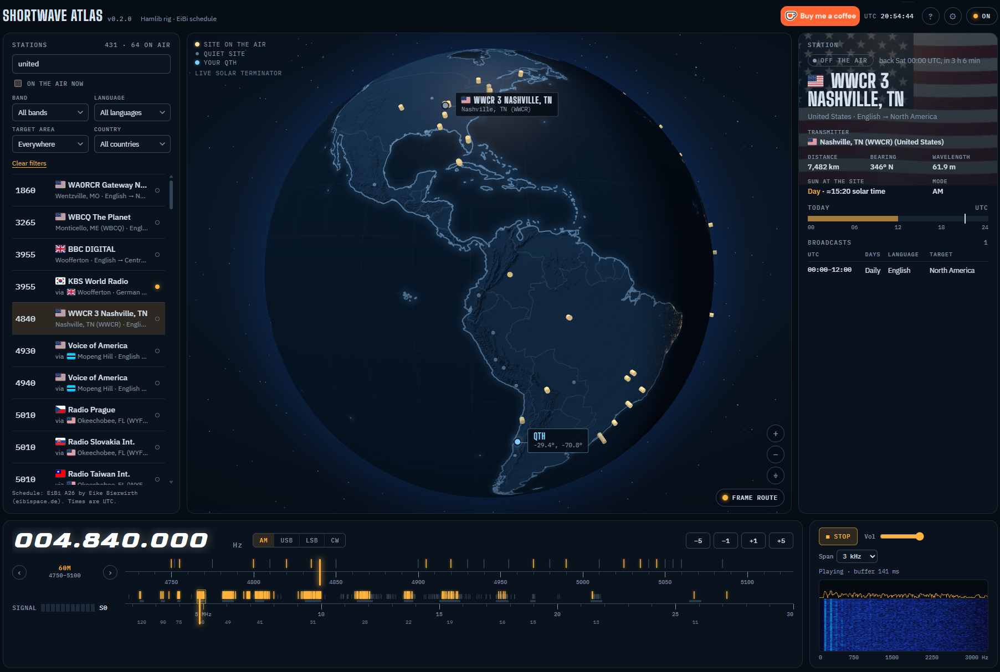

# Shortwave Atlas

[](https://github.com/juantoledo/shortwave-atlas/actions/workflows/ci.yml)
[](https://github.com/juantoledo/shortwave-atlas/releases/latest)
[](https://github.com/juantoledo/shortwave-atlas/releases)
[](LICENSE)


[](https://ko-fi.com/J6F024AKJE)

Shortwave atlas for your rig. Tune a frequency and the globe flies to the transmitter, draws the
great-circle path to your QTH over the live day/night terminator, and opens the station's card:
on-air status, distance, bearing, the Sun at the transmitter, and the schedule.



The station data is the [EiBi](http://www.eibispace.de/dx/) shortwave schedule (about 2,000
frequency and station pairs from 170 transmitter sites), bundled with each release. Search it by
station, country, language or kHz, filter by band, language, target area and country, or click a
transmitter on the globe to list what it broadcasts.

The rig is a frequency sensor: Shortwave Atlas only reads and sets frequency and mode, reads the
S-meter and switches power. **It never transmits.**

It runs on Linux, Windows and macOS.

Two ways to use it:
- **Desktop app** (Tauri v2), on the machine wired to the rig. It can play the rig's audio and show
  the audio waterfall too.
- **Remote browser**, over Tailscale or a LAN. This is `swatlas-server` (headless) or the desktop
  app with `server.enabled`. It includes low-latency rig audio and an audio waterfall.

## Layout
```
crates/atlas-core     pure logic: geo, UTC schedules, station lookup, API types (exported to TS)
crates/atlas-rig      RigBackend trait, Hamlib (rigctld) and simulated backends, poller, rigctld supervisor
crates/atlas-server   config, the Atlas dispatcher, audio hub, HTTP/WebSocket server, swatlas-server binary
src-tauri             desktop shell (per-OS bundle settings in tauri.{linux,windows,macos}.conf.json)
ui                    React + TypeScript + Vite (react-globe.gl)
assets/sidecars       builds the rigctld and ffmpeg that the Windows and macOS installers ship
data/eibi             the EiBi schedule bundled into the binary (see data/eibi/README.md)
```

## Install
Releases have installers for each OS: `.deb` or AppImage for Linux, `-setup.exe` for
Windows, and `.dmg` for macOS. There is also a `swatlas-server` archive per OS.

| | Rig (rigctld) and audio (ffmpeg) | Serial port | Notes |
|---|---|---|---|
| **Linux** | System packages: `sudo apt install libhamlib-utils ffmpeg` (the `.deb` pulls them in) | `/dev/serial/by-id/...`; needs the `dialout` group | |
| **Windows** | Included in the installer | `COMn`. For the FTDX10, the CP2105's **Enhanced COM Port**. Windows usually installs the Silicon Labs CP210x driver by itself; if not, get the VCP driver from Silicon Labs | Not signed yet: SmartScreen asks; choose *More info → Run anyway* |
| **macOS** (11+) | Included in the app | `/dev/cu.*` (for example `cu.SLAB_USBtoUART`) | Not notarized yet: the first time, right-click the app → *Open*. On the first **Listen**, macOS asks for microphone access, which is how the radio's USB sound card arrives |

The bundled programs and their licenses are listed in [THIRD_PARTY_NOTICES.md](THIRD_PARTY_NOTICES.md).

## Setup for development (Linux)
```
# Rust and Node 22
curl --proto '=https' --tlsv1.2 -sSf https://sh.rustup.rs | sh
nvm install 22
# Tauri system libraries
sudo apt install libwebkit2gtk-4.1-dev build-essential libssl-dev libayatana-appindicator3-dev librsvg2-dev
# Hamlib and serial access
sudo apt install libhamlib-utils
sudo usermod -aG dialout $USER      # log out and back in

npm install && npm --prefix ui install
```
On Windows or macOS, install Rust, Node 22 and the [Tauri prerequisites](https://tauri.app/start/prerequisites/).
Then build the sidecars once: `python3 assets/sidecars/build.py universal-apple-darwin` on a Mac, or
`x86_64-pc-windows-msvc` from Linux with `mingw-w64`. Without them, put Hamlib and ffmpeg on PATH:
Shortwave Atlas looks next to its executable, then on PATH, then in Homebrew (`/opt/homebrew/bin`,
`/usr/local/bin`) and in Hamlib's Windows install folder.

## Run
| What | Command |
|---|---|
| Desktop app (dev, hot reload) | `npm run dev` |
| Desktop app (bundle .deb/AppImage) | `npm run build` |
| Headless server + remote UI | `npm run server` → http://127.0.0.1:8080 |
| UI only, against a running server | `npm --prefix ui run dev` (proxies `/api` to :8080) |
| All tests | `npm test` (`cargo test` + Vitest) |

With no config it runs a **simulated rig**. Try a real Hamlib without hardware:
```
rigctld -m 1 &                       # Hamlib dummy rig on :4532
SWATLAS_RIG=external npm run dev
rigctl -m 2 -r 127.0.0.1:4532 F 5025000    # the globe flies to Cuba
```

## Configure
The easiest way: press **⚙** in the app (or the "connect your radio" link on a first run). There you
can:
- pick **My radio** (Shortwave Atlas starts and supervises Hamlib `rigctld`) or **Running rigctld**
  (connect to one you already run);
- choose the Hamlib model, serial port and baud rate;
- press **Connect**.

The **Audio** section on the same page turns on **Listen**. It captures the rig's audio from a
sound card with `ffmpeg` (`sudo apt install ffmpeg`), for the desktop app and remote browsers alike.
It lists the sound cards that can capture, with the rig's USB codec first (the Burr-Brown
"USB AUDIO CODEC" inside Yaesu, Icom and Kenwood rigs). It also lets you choose the sample rate:
16 kHz carries audio up to 8 kHz and costs 256 kbit/s per listener. **Apply** switches over live and
saves the choice. The page shows whether ffmpeg is capturing, and explains a busy or missing card or
a missing `audio` group. The ffmpeg executable path can only be set in the file.

The page shows the live connection status and explains common problems: no `dialout` permission,
port unplugged or busy, the rigctld TCP port taken, the radio not answering, Hamlib missing.
**Connect** saves the choice into `swatlas.toml`, keeping your comments. The rigctld executable path
can only be set in the file, never from the page.

To configure by hand, copy `docs/swatlas.example.toml` to `~/.config/swatlas/swatlas.toml`. The
desktop app and the server share it. The prototype's environment variables (`RIGCTLD_PORT`, `WEB_AUTH`, `AUDIO_DEVICE`, ...)
still work as overrides. A QTH picked by clicking the globe is saved in `~/.config/swatlas/qth.json`.

Rig-specific notes live in `docs/rigs/` (start with `ftdx10.md`).

## Updates
When a new version is out, a lamp on the globe says **Update x.y.z available**. Open it for the
release notes and:
- **Windows, macOS and the Linux AppImage:** press **Install and restart**. Shortwave Atlas downloads the
  update, checks its signature, stops rigctld and ffmpeg, installs and starts again. Nothing is
  downloaded until you press it.
- **Linux `.deb` and `swatlas-server`:** the panel links to the release; install it the way you
  installed the first one.
- **A remote browser** sees the notice, but only the window on the computer wired to the radio
  can install.

*Settings → Updates* turns the automatic check off and picks the channel: **Stable**, or **Beta**
for release candidates as well. The check reads one small file from GitHub Pages at start and
every 6 hours; nothing about you or your radio is sent. In the config file it is `[update]`
(`check = false`), or set `SWATLAS_UPDATE_CHECK=0`.

Every release lists `SHA256SUMS`, CycloneDX SBOMs and GitHub build attestations. To check that a
file was built by this repository's release workflow: `gh attestation verify <file> -R
juantoledo/shortwave-atlas`. How releases are made: [docs/releasing.md](docs/releasing.md).

## Remote access
`swatlas-server` refuses to listen beyond loopback without `server.auth`. Use Tailscale rather than
exposing it to the internet. Release archives hold the server, the built UI and (Windows, macOS)
rigctld and ffmpeg side by side; run it from there.

- **Windows:** run `swatlas-server.exe` at logon from Task Scheduler, or as a service with
  [NSSM](https://nssm.cc/), with `WEB_BIND`/`WEB_AUTH` set as environment variables. Windows
  Firewall asks the first time it listens beyond loopback.
- **macOS:** a LaunchAgent (`~/Library/LaunchAgents/org.swatlas.server.plist`) with
  `ProgramArguments` set to the server's path, `EnvironmentVariables` for `WEB_BIND`/`WEB_AUTH`, and
  `KeepAlive` set to true. Load it with `launchctl load`.
- **Linux:** systemd, below.

`/etc/systemd/system/swatlas.service`
```
[Unit]
Description=Shortwave Atlas server
After=network.target

[Service]
ExecStart=/home/jtoledoc/dev/swatlas/target/release/swatlas-server
Environment=SWATLAS_UI_DIR=/home/jtoledoc/dev/swatlas/ui/dist
Environment=WEB_BIND=0.0.0.0
Environment=WEB_AUTH=jtoledoc:A_LONG_PASSWORD
Restart=always
RestartSec=5
User=jtoledoc
Group=dialout

[Install]
WantedBy=multi-user.target
```
With `rig.backend = "spawn"`, the server starts and supervises its own `rigctld`, so no separate
rigctld service is needed. Don't run another CAT program on the same serial port. The audio
device can only be opened by one program at a time.

## Credits
- Coastlines, borders and shaded relief: [Natural Earth](https://www.naturalearthdata.com/) (public
  domain), via [world-atlas](https://github.com/topojson/world-atlas).
- City lights: NASA Earth Observatory, Black Marble 2016 (public domain).
- Station schedules: [EiBi](http://www.eibispace.de/dx/) by Eike Bierwirth, free to use and
  redistribute; mirrored weekly from [radiomap](https://github.com/juantoledo/radiomap).
- Flags: [flag-icons](https://github.com/lipis/flag-icons) (MIT).

The globe rasters in `ui/src/assets/globe/` are built by `assets/make_globe_rasters.py`.

## Status
This is the kickstart: phase 1 (skeleton) plus remote access, audio and i18n (English and Spanish).
The EiBi schedule is in (phase 2), held in memory: SQLite only if notes and logs need it.
Next steps: map polish, real-rig validation, then notes/logs, the band scan, a shared rigctld
port and packaging.
